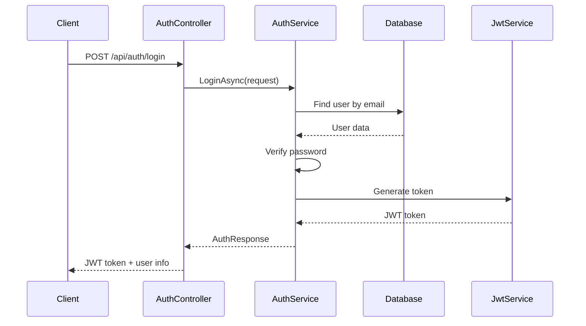
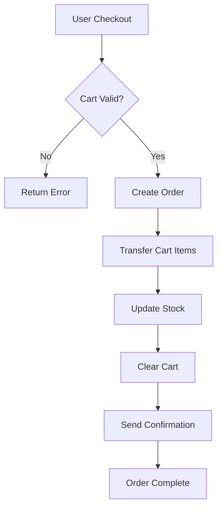

# OnlineStore - Clean Architecture E-Commerce Application

## متجر إلكتروني - تطبيق التجارة الإلكترونية بهندسة معمارية نظيفة

### English | العربية

---

## 📋 Table of Contents | جدول المحتويات

- [Project Overview | نظرة عامة على المشروع](#project-overview--نظرة-عامة-على-المشروع)
- [Architecture | الهندسة المعمارية](#architecture--الهندسة-المعمارية)
- [Project Structure | هيكل المشروع](#project-structure--هيكل-المشروع)
- [Domain Layer | طبقة النطاق](#domain-layer--طبقة-النطاق)
- [Application Layer | طبقة التطبيق](#application-layer--طبقة-التطبيق)
- [Infrastructure Layer | طبقة البنية التحتية](#infrastructure-layer--طبقة-البنية-التحتية)
- [Presentation Layer | طبقة العرض](#presentation-layer--طبقة-العرض)
- [Database Schema | مخطط قاعدة البيانات](#database-schema--مخطط-قاعدة-البيانات)
- [API Endpoints | نقاط الاتصال بالواجهة البرمجية](#api-endpoints--نقاط-الاتصال-بالواجهة-البرمجية)
- [Getting Started | البدء](#getting-started--البدء)
- [Authentication Flow | تدفق المصادقة](#authentication-flow--تدفق-المصادقة)
- [Business Logic Flow | تدفق المنطق التجاري](#business-logic-flow--تدفق-المنطق-التجاري)

---

## Project Overview | نظرة عامة على المشروع

### English
This is a complete e-commerce application built using Clean Architecture principles with ASP.NET Core 8.0. The application provides a robust foundation for online shopping with features including user authentication, product management, shopping cart, and order processing.

### العربية
هذا تطبيق تجارة إلكترونية كامل مبني باستخدام مبادئ الهندسة المعمارية النظيفة مع ASP.NET Core 8.0. يوفر التطبيق أساسًا قويًا للتسوق عبر الإنترنت مع ميزات تشمل مصادقة المستخدم، وإدارة المنتجات، وعربة التسوق، ومعالجة الطلبات.

---

## Architecture | الهندسة المعمارية

### English
This project follows Clean Architecture principles with clear separation of concerns:

- **Domain Layer**: Core business entities and rules
- **Application Layer**: Use cases and business logic
- **Infrastructure Layer**: Data access and external services
- **Presentation Layer**: Web API controllers and endpoints

### العربية
يتبع هذا المشروع مبادئ الهندسة المعمارية النظيفة مع فصل واضح للاهتمامات:

- **طبقة النطاق**: الكيانات والقواعد التجارية الأساسية
- **طبقة التطبيق**: حالات الاستخدام والمنطق التجاري
- **طبقة البنية التحتية**: الوصول للبيانات والخدمات الخارجية
- **طبقة العرض**: وحدات التحكم ونقاط الاتصال لواجهة الويب البرمجية

---

## Project Structure | هيكل المشروع

```
OnlineStore/
├── src/
│   ├── OnlineStore.Domain/           # Domain Layer | طبقة النطاق
│   ├── OnlineStore.Application/      # Application Layer | طبقة التطبيق
│   ├── OnlineStore.Infrastructure/   # Infrastructure Layer | طبقة البنية التحتية
│   └── OnlineStore.WebApi/          # Presentation Layer | طبقة العرض
└── OnlineStore.sln                  # Solution File | ملف الحل
```

---

## Domain Layer | طبقة النطاق

### English
The Domain layer contains the core business entities and domain logic. It has no dependencies on other layers.

### العربية
تحتوي طبقة النطاق على الكيانات التجارية الأساسية ومنطق النطاق. ليس لديها تبعيات على الطبقات الأخرى.

### Entities | الكيانات

#### 1. **AppUser** | مستخدم التطبيق
```csharp
// English: Represents a user in the system with authentication capabilities
// العربية: يمثل مستخدمًا في النظام مع إمكانيات المصادقة
public class AppUser : IdentityUser<int>
{
    public string FirstName { get; set; }
    public string LastName { get; set; }
    public DateTime CreatedAt { get; set; }
    public Cart? Cart { get; set; }
    public ICollection<Order> Orders { get; set; }
}
```

#### 2. **Product** | المنتج
```csharp
// English: Represents a product in the store
// العربية: يمثل منتجًا في المتجر
public class Product : BaseEntity
{
    public string Name { get; set; }
    public string Description { get; set; }
    public decimal Price { get; set; }
    public int Stock { get; set; }
    public string? ImageUrl { get; set; }
    public int CategoryId { get; set; }
    public Category Category { get; set; }
}
```

#### 3. **Category** | الفئة
```csharp
// English: Represents a product category
// العربية: يمثل فئة المنتج
public class Category : BaseEntity
{
    public string Name { get; set; }
    public string? Description { get; set; }
    public ICollection<Product> Products { get; set; }
}
```

#### 4. **Cart** | عربة التسوق
```csharp
// English: Represents a user's shopping cart
// العربية: يمثل عربة التسوق الخاصة بالمستخدم
public class Cart : BaseEntity
{
    public int UserId { get; set; }
    public AppUser User { get; set; }
    public ICollection<CartItem> Items { get; set; }
}
```

#### 5. **CartItem** | عنصر عربة التسوق
```csharp
// English: Represents an item in the shopping cart
// العربية: يمثل عنصرًا في عربة التسوق
public class CartItem : BaseEntity
{
    public int CartId { get; set; }
    public int ProductId { get; set; }
    public int Quantity { get; set; }
    public Cart Cart { get; set; }
    public Product Product { get; set; }
}
```

#### 6. **Order** | الطلب
```csharp
// English: Represents a customer order
// العربية: يمثل طلب العميل
public class Order : BaseEntity
{
    public int UserId { get; set; }
    public decimal TotalAmount { get; set; }
    public OrderStatus Status { get; set; }
    public string ShippingAddress { get; set; }
    public AppUser User { get; set; }
    public ICollection<OrderItem> Items { get; set; }
}
```

#### 7. **OrderItem** | عنصر الطلب
```csharp
// English: Represents an item within an order
// العربية: يمثل عنصرًا ضمن الطلب
public class OrderItem : BaseEntity
{
    public int OrderId { get; set; }
    public int ProductId { get; set; }
    public int Quantity { get; set; }
    public decimal UnitPrice { get; set; }
    public Order Order { get; set; }
    public Product Product { get; set; }
}
```

### Enums | التعدادات

#### **OrderStatus** | حالة الطلب
```csharp
public enum OrderStatus
{
    Pending,    // معلق
    Processing, // قيد المعالجة
    Shipped,    // تم الشحن
    Delivered,  // تم التسليم
    Cancelled   // ملغى
}
```

---

## Application Layer | طبقة التطبيق

### English
The Application layer contains business logic, use cases, DTOs, and interfaces. It orchestrates the flow of data and enforces business rules.

### العربية
تحتوي طبقة التطبيق على المنطق التجاري وحالات الاستخدام وكائنات نقل البيانات والواجهات. تنسق تدفق البيانات وتفرض القواعد التجارية.

### DTOs | كائنات نقل البيانات

#### Request DTOs | كائنات طلب البيانات

**RegisterRequest** | طلب التسجيل
```csharp
// English: Data transfer object for user registration
// العربية: كائن نقل البيانات لتسجيل المستخدم
public class RegisterRequest
{
    public string Email { get; set; }
    public string Password { get; set; }
    public string FirstName { get; set; }
    public string LastName { get; set; }
}
```

**LoginRequest** | طلب تسجيل الدخول
```csharp
// English: Data transfer object for user login
// العربية: كائن نقل البيانات لتسجيل دخول المستخدم
public class LoginRequest
{
    public string Email { get; set; }
    public string Password { get; set; }
}
```

**CreateProductRequest** | طلب إنشاء منتج
```csharp
// English: Data transfer object for creating a new product
// العربية: كائن نقل البيانات لإنشاء منتج جديد
public class CreateProductRequest
{
    public string Name { get; set; }
    public string Description { get; set; }
    public decimal Price { get; set; }
    public int Stock { get; set; }
    public string? ImageUrl { get; set; }
    public int CategoryId { get; set; }
}
```

#### Response DTOs | كائنات استجابة البيانات

**AuthResponse** | استجابة المصادقة
```csharp
// English: Response object containing authentication information
// العربية: كائن الاستجابة الذي يحتوي على معلومات المصادقة
public class AuthResponse
{
    public string Token { get; set; }
    public string Email { get; set; }
    public string FirstName { get; set; }
    public string LastName { get; set; }
    public List<string> Roles { get; set; }
}
```

### Interfaces | الواجهات

#### Repository Interfaces | واجهات المستودعات

**IRepository<T>** | واجهة المستودع العامة
```csharp
// English: Generic repository interface for basic CRUD operations
// العربية: واجهة المستودع العامة لعمليات CRUD الأساسية
public interface IRepository<T> where T : BaseEntity
{
    Task<T?> GetByIdAsync(int id);
    Task<IEnumerable<T>> GetAllAsync();
    Task<T> AddAsync(T entity);
    Task UpdateAsync(T entity);
    Task DeleteAsync(int id);
}
```

#### Service Interfaces | واجهات الخدمات

**IAuthService** | واجهة خدمة المصادقة
```csharp
// English: Interface for authentication service
// العربية: واجهة خدمة المصادقة
public interface IAuthService
{
    Task<AuthResponse> RegisterAsync(RegisterRequest request);
    Task<AuthResponse> LoginAsync(LoginRequest request);
}
```

### Validators | المدققات

#### **RegisterRequestValidator** | مدقق طلب التسجيل
```csharp
// English: Validator for user registration requests
// العربية: مدقق طلبات تسجيل المستخدم
public class RegisterRequestValidator : AbstractValidator<RegisterRequest>
{
    public RegisterRequestValidator()
    {
        RuleFor(x => x.Email)
            .NotEmpty().WithMessage("Email is required")
            .EmailAddress().WithMessage("Invalid email format");
        
        RuleFor(x => x.Password)
            .MinimumLength(6).WithMessage("Password must be at least 6 characters");
    }
}
```

---

## Infrastructure Layer | طبقة البنية التحتية

### English
The Infrastructure layer handles data persistence, external services, and implements interfaces defined in the Application layer.

### العربية
تتعامل طبقة البنية التحتية مع استمرارية البيانات والخدمات الخارجية وتنفذ الواجهات المحددة في طبقة التطبيق.

### Database Context | سياق قاعدة البيانات

**AppDbContext** | سياق قاعدة بيانات التطبيق
```csharp
// English: Entity Framework DbContext for the application
// العربية: سياق DbContext لإطار عمل الكيان للتطبيق
public class AppDbContext : IdentityDbContext<AppUser, AppRole, int>
{
    public DbSet<Product> Products { get; set; }
    public DbSet<Category> Categories { get; set; }
    public DbSet<Cart> Carts { get; set; }
    public DbSet<CartItem> CartItems { get; set; }
    public DbSet<Order> Orders { get; set; }
    public DbSet<OrderItem> OrderItems { get; set; }
}
```

### Repositories | المستودعات

**ProductRepository** | مستودع المنتجات
```csharp
// English: Repository implementation for Product entity
// العربية: تنفيذ المستودع لكيان المنتج
public class ProductRepository : EfRepository<Product>, IProductRepository
{
    public async Task<PagedResult<Product>> GetPagedAsync(ProductListQuery query)
    {
        // Implementation for paginated product retrieval
        // تنفيذ لاسترداد المنتجات مع التصفح
    }
    
    public async Task<IEnumerable<Product>> GetByCategoryAsync(int categoryId)
    {
        // Implementation for getting products by category
        // تنفيذ للحصول على المنتجات حسب الفئة
    }
}
```

### Services | الخدمات

**AuthService** | خدمة المصادقة
```csharp
// English: Authentication service implementation
// العربية: تنفيذ خدمة المصادقة
public class AuthService : IAuthService
{
    public async Task<AuthResponse> RegisterAsync(RegisterRequest request)
    {
        // User registration logic
        // منطق تسجيل المستخدم
    }
    
    public async Task<AuthResponse> LoginAsync(LoginRequest request)
    {
        // User login logic with JWT token generation
        // منطق تسجيل دخول المستخدم مع توليد رمز JWT
    }
}
```

**JwtService** | خدمة JWT
```csharp
// English: Service for generating and validating JWT tokens
// العربية: خدمة لتوليد والتحقق من رموز JWT
public class JwtService
{
    public string GenerateToken(AppUser user, IList<string> roles)
    {
        // JWT token generation logic
        // منطق توليد رمز JWT
    }
}
```

---

## Presentation Layer | طبقة العرض

### English
The Presentation layer contains Web API controllers that handle HTTP requests and responses.

### العربية
تحتوي طبقة العرض على وحدات تحكم واجهة الويب البرمجية التي تتعامل مع طلبات واستجابات HTTP.

### Controllers | وحدات التحكم

#### **AuthController** | وحدة تحكم المصادقة
```csharp
// English: Handles authentication-related endpoints
// العربية: تتعامل مع نقاط الاتصال المتعلقة بالمصادقة
[ApiController]
[Route("api/[controller]")]
public class AuthController : ControllerBase
{
    [HttpPost("register")]
    public async Task<ActionResult<AuthResponse>> Register(RegisterRequest request)
    {
        // User registration endpoint
        // نقطة اتصال تسجيل المستخدم
    }
    
    [HttpPost("login")]
    public async Task<ActionResult<AuthResponse>> Login(LoginRequest request)
    {
        // User login endpoint
        // نقطة اتصال تسجيل دخول المستخدم
    }
}
```

#### **ProductsController** | وحدة تحكم المنتجات
```csharp
// English: Handles product-related operations
// العربية: تتعامل مع العمليات المتعلقة بالمنتجات
[ApiController]
[Route("api/[controller]")]
public class ProductsController : ControllerBase
{
    [HttpGet]
    public async Task<ActionResult<PagedResult<ProductResponse>>> GetProducts([FromQuery] ProductListQuery query)
    {
        // Get paginated list of products
        // الحصول على قائمة المنتجات مع التصفح
    }
    
    [HttpGet("{id}")]
    public async Task<ActionResult<ProductResponse>> GetProduct(int id)
    {
        // Get single product by ID
        // الحصول على منتج واحد بالمعرف
    }
    
    [HttpPost]
    [Authorize(Roles = "Admin")]
    public async Task<ActionResult<ProductResponse>> CreateProduct(CreateProductRequest request)
    {
        // Create new product (Admin only)
        // إنشاء منتج جديد (للمديرين فقط)
    }
}
```

---

## Database Schema | مخطط قاعدة البيانات

### English
The database schema represents the relationships between entities:

### العربية
يمثل مخطط قاعدة البيانات العلاقات بين الكيانات:

```
Users (AspNetUsers)
├── Id (Primary Key)
├── Email
├── FirstName
├── LastName
└── CreatedAt

Products
├── Id (Primary Key)
├── Name
├── Description
├── Price
├── Stock
├── ImageUrl
├── CategoryId (Foreign Key → Categories.Id)
├── CreatedAt
└── UpdatedAt

Categories
├── Id (Primary Key)
├── Name
├── Description
├── CreatedAt
└── UpdatedAt

Carts
├── Id (Primary Key)
├── UserId (Foreign Key → Users.Id)
├── CreatedAt
└── UpdatedAt

CartItems
├── Id (Primary Key)
├── CartId (Foreign Key → Carts.Id)
├── ProductId (Foreign Key → Products.Id)
├── Quantity
├── CreatedAt
└── UpdatedAt

Orders
├── Id (Primary Key)
├── UserId (Foreign Key → Users.Id)
├── TotalAmount
├── Status
├── ShippingAddress
├── CreatedAt
└── UpdatedAt

OrderItems
├── Id (Primary Key)
├── OrderId (Foreign Key → Orders.Id)
├── ProductId (Foreign Key → Products.Id)
├── Quantity
├── UnitPrice
├── CreatedAt
└── UpdatedAt
```

---

## API Endpoints | نقاط الاتصال بالواجهة البرمجية

### Authentication | المصادقة
```
POST /api/auth/register    # Register new user | تسجيل مستخدم جديد
POST /api/auth/login       # User login | تسجيل دخول المستخدم
```

### Products | المنتجات
```
GET    /api/products           # Get all products | الحصول على جميع المنتجات
GET    /api/products/{id}      # Get product by ID | الحصول على منتج بالمعرف
POST   /api/products           # Create product (Admin) | إنشاء منتج (للمديرين)
PUT    /api/products/{id}      # Update product (Admin) | تحديث منتج (للمديرين)
DELETE /api/products/{id}      # Delete product (Admin) | حذف منتج (للمديرين)
```

### Categories | الفئات
```
GET    /api/categories         # Get all categories | الحصول على جميع الفئات
GET    /api/categories/{id}    # Get category by ID | الحصول على فئة بالمعرف
POST   /api/categories         # Create category (Admin) | إنشاء فئة (للمديرين)
PUT    /api/categories/{id}    # Update category (Admin) | تحديث فئة (للمديرين)
DELETE /api/categories/{id}    # Delete category (Admin) | حذف فئة (للمديرين)
```

### Cart | عربة التسوق
```
GET    /api/cart               # Get user's cart | الحصول على عربة المستخدم
POST   /api/cart/items         # Add item to cart | إضافة عنصر للعربة
PUT    /api/cart/items/{id}    # Update cart item | تحديث عنصر العربة
DELETE /api/cart/items/{id}    # Remove item from cart | إزالة عنصر من العربة
```

### Orders | الطلبات
```
GET    /api/orders             # Get user's orders | الحصول على طلبات المستخدم
GET    /api/orders/{id}        # Get order by ID | الحصول على طلب بالمعرف
POST   /api/orders/checkout    # Create order from cart | إنشاء طلب من العربة
GET    /api/orders/admin       # Get all orders (Admin) | الحصول على جميع الطلبات (للمديرين)
```

---

## Getting Started | البدء

### Prerequisites | المتطلبات الأساسية

**English:**
- .NET 8.0 SDK
- SQL Server (LocalDB or full version)
- Visual Studio 2022 or VS Code

**العربية:**
- .NET 8.0 SDK
- SQL Server (LocalDB أو النسخة الكاملة)
- Visual Studio 2022 أو VS Code

### Installation | التثبيت

**English:**
1. Clone the repository
2. Navigate to the project directory
3. Restore NuGet packages
4. Update the database
5. Run the application

**العربية:**
1. استنساخ المستودع
2. الانتقال إلى دليل المشروع
3. استعادة حزم NuGet
4. تحديث قاعدة البيانات
5. تشغيل التطبيق

```bash
# Clone repository | استنساخ المستودع
git clone <repository-url>

# Navigate to project | الانتقال للمشروع
cd E-Commerce

# Restore packages | استعادة الحزم
dotnet restore

# Update database | تحديث قاعدة البيانات
cd src/OnlineStore.WebApi
dotnet ef database update

# Run application | تشغيل التطبيق
dotnet run
```

### Configuration | التكوين

**appsettings.json:**
```json
{
  "ConnectionStrings": {
    "Default": "Server=(localdb)\\mssqllocaldb;Database=OnlineStoreDb;Trusted_Connection=true;MultipleActiveResultSets=true"
  },
  "Jwt": {
    "Key": "YourSecretKeyHereMustBeAtLeast32Characters",
    "Issuer": "OnlineStore",
    "Audience": "OnlineStoreUsers"
  }
}
```

---

## Authentication Flow | تدفق المصادقة

### English
The authentication flow uses JWT tokens for secure API access:

1. **User Registration**: User provides email, password, and personal information
2. **Password Hashing**: Password is hashed using ASP.NET Core Identity
3. **User Login**: User provides credentials
4. **Token Generation**: JWT token is generated with user claims and roles
5. **API Access**: Token is included in Authorization header for protected endpoints

### العربية
يستخدم تدفق المصادقة رموز JWT للوصول الآمن لواجهة البرمجة:

1. **تسجيل المستخدم**: يقدم المستخدم البريد الإلكتروني وكلمة المرور والمعلومات الشخصية
2. **تشفير كلمة المرور**: يتم تشفير كلمة المرور باستخدام ASP.NET Core Identity
3. **تسجيل دخول المستخدم**: يقدم المستخدم بيانات الاعتماد
4. **توليد الرمز**: يتم توليد رمز JWT مع مطالبات وأدوار المستخدم
5. **الوصول لواجهة البرمجة**: يتم تضمين الرمز في رأس التخويل للنقاط المحمية



---

## Business Logic Flow | تدفق المنطق التجاري

### Shopping Cart Flow | تدفق عربة التسوق

**English:**
1. User adds product to cart
2. System checks product availability
3. Cart item is created or quantity updated
4. Cart total is recalculated

**العربية:**
1. يضيف المستخدم منتجًا للعربة
2. يتحقق النظام من توفر المنتج
3. يتم إنشاء عنصر العربة أو تحديث الكمية
4. يتم إعادة حساب إجمالي العربة

### Order Processing Flow | تدفق معالجة الطلبات

**English:**
1. User initiates checkout
2. System validates cart items and stock
3. Order is created with "Pending" status
4. Cart items are transferred to order items
5. Product stock is updated
6. Cart is cleared
7. Order confirmation is sent

**العربية:**
1. يبدأ المستخدم عملية الدفع
2. يتحقق النظام من عناصر العربة والمخزون
3. يتم إنشاء الطلب بحالة "معلق"
4. يتم نقل عناصر العربة لعناصر الطلب
5. يتم تحديث مخزون المنتج
6. يتم مسح العربة
7. يتم إرسال تأكيد الطلب



---

## Key Features | الميزات الرئيسية

### English
- **Clean Architecture**: Separation of concerns with clear layer boundaries
- **JWT Authentication**: Secure token-based authentication
- **Role-based Authorization**: Admin and User roles with different permissions
- **Entity Framework Core**: Code-first database approach
- **AutoMapper**: Object-to-object mapping
- **FluentValidation**: Input validation with clear error messages
- **Swagger Documentation**: Interactive API documentation
- **Serilog Logging**: Structured logging for monitoring
- **CORS Support**: Cross-origin resource sharing configuration

### العربية
- **الهندسة المعمارية النظيفة**: فصل الاهتمامات مع حدود طبقات واضحة
- **مصادقة JWT**: مصادقة آمنة قائمة على الرموز
- **تخويل قائم على الأدوار**: أدوار المدير والمستخدم مع صلاحيات مختلفة
- **Entity Framework Core**: نهج قاعدة البيانات الأولى للكود
- **AutoMapper**: تخطيط الكائن إلى الكائن
- **FluentValidation**: التحقق من الإدخال مع رسائل خطأ واضحة
- **توثيق Swagger**: توثيق تفاعلي لواجهة البرمجة
- **تسجيل Serilog**: تسجيل منظم للمراقبة
- **دعم CORS**: تكوين مشاركة الموارد عبر المصادر

---

## Contributing | المساهمة

### English
1. Fork the repository
2. Create a feature branch
3. Make your changes
4. Add tests if applicable
5. Submit a pull request

### العربية
1. تشعيب المستودع
2. إنشاء فرع ميزة
3. إجراء التغييرات
4. إضافة اختبارات إذا كان ذلك مناسبًا
5. تقديم طلب سحب

---

## License | الترخيص

This project is licensed under the MIT License.
هذا المشروع مرخص بموجب ترخيص MIT.

---

## Support | الدعم

For questions or support, please open an issue in the repository.
للأسئلة أو الدعم، يرجى فتح مشكلة في المستودع.
